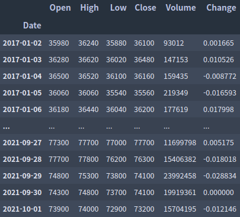
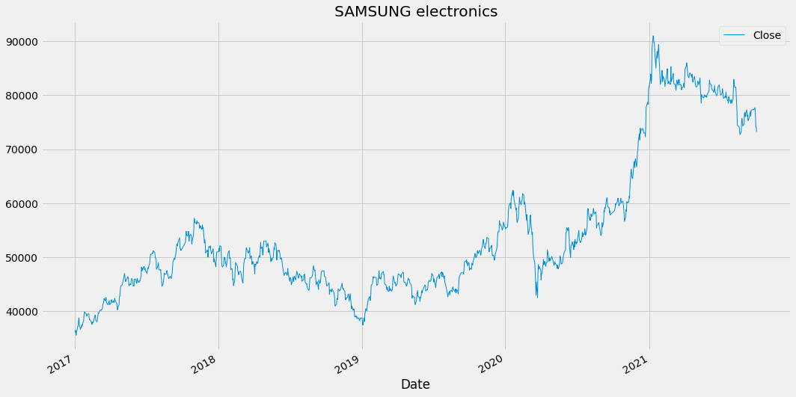

# 볼린저밴드를 이용한 기본전략

본 포스팅에서는 볼린저밴드를 활용한 가장 기본적이고 간단한 전략에 대해서 알아본다.

볼린저 밴드 이용한 가장 간단한 전략은 주가가 평균으로 회귀한다는 전제를 가지고 만들어진 평균회귀 전략이다

주가가 하단밴드를 위에서 아래로 통과하면 주가가 다시 상승할것으로 예상해 매수를 진행하고, 주가가 상단밴드를 아래에서 위로 통과하면 주가가 다시 하강할 것으로 예상하여 매도를 진행한다.

## 전략실행

본 포스팅에서는 삼성전자의 일일 종가데이터에 전략을 실행시켜보겠다.
우선 삼성전자의 일일 종가데이터를 불러온다.

여기서 사용할 정보는 종가데이터이므로 종가데이터만 떼어내서 그래프로 나타내 보자.

종가그래프가 위처럼 나타난다.

