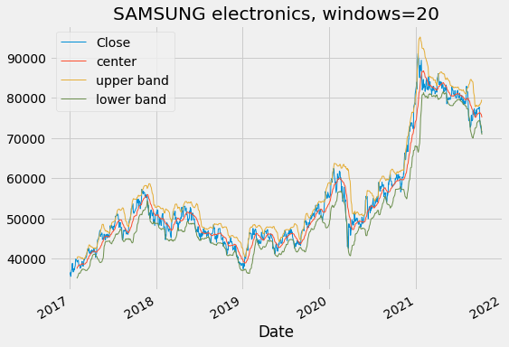

이전 포스팅에서는 볼린저밴드를 이용한 기본적인 전략에 대해서 알아보았다.

단순히 종가가 볼린저밴드 상,하단 밴드를 통과하는것만으로 전략을 만들었었다.

하지만 이 상태로는 다른 전략들과 접목시키거나 머신러닝 전략에 적용시키기에는 한계점이 크다.

따라서 볼린저 밴드로 부터 몇몇 정량적 특성을 찾아내려고 한다.

일단 볼린저 밴드 공식에서 바로 찾아낼수 있는 변수가 있다.  

상단밴드 = 중간밴드 + (windows)일 이동표준편차 * n  
중단밴드 = (windows)일 이동 평균선  
하단밴드 = 중간밴드 - (windows)일 이동표준편차 * n  

바로 이동평균선의 windows의 크기(며칠 간의 이동평균선을 사용하는지)와

하단밴드와 상단밴드를 만들 때 더하고 빼는 표준편차의 계수(n의 크기) 이다.

|windows=20|windows=40|
|:-:|:-:|
|||

|표준편차계수=1.5|표준편차계수=2|
|:-:|:-:|
|||

<사진추가예정>  

상단, 하단밴드에 대한 종가의 상대적인 위치를 숫자로서 표현할 수 있다고 생각했다.  
따라서 종가의 상대적인 위치를  
(중간밴드 - 종가) / (상단밴드 - 하단밴드)  
로 나타낼수 있었다. 이 값이 어떤 분포를 가지는지 먼저 알아보기로 했다.  

데이터로는 최근 약 10년간의 삼성전자 데이터를 사용했다.  

위 과정들로 만든 변수들을 통해서 전략을 구성하고 백테스팅을 진행한다.

이 때 전략이 얼마나 예측을 잘하는지에 대한 평가지표가 필요하다.

평가지표는 수익률이 될 수도 있고, 주가의 상승하락 트렌드가 될 수 도있다.

확실한건 한 가지 평가지표만으로는 안정적인 전략을 짤 수 없는다는 것이다.

다음 단계 포스팅에서는 전략의 평가지표에 대해서 탐구해본다.

